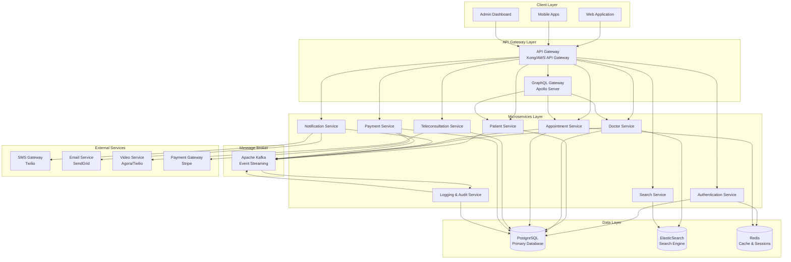
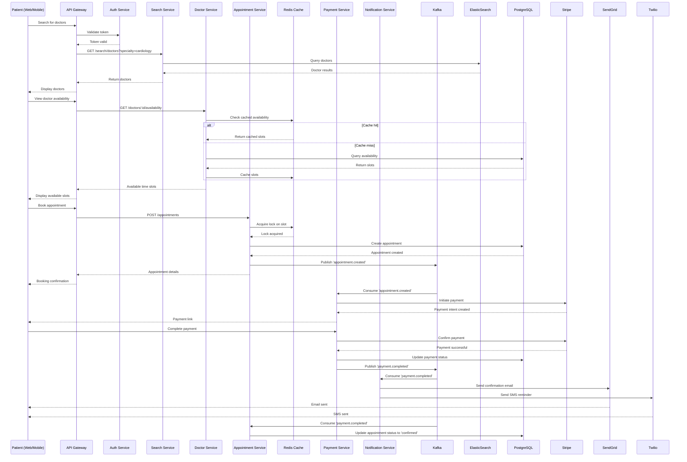
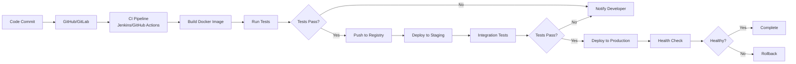

# Markini - Medical Appointment Platform
## System Architecture Documentation

---

## 1. Executive Summary

Markini is a comprehensive medical appointment platform designed to connect patients with healthcare providers, enabling seamless appointment scheduling, teleconsultations, and healthcare management. This document outlines the complete system architecture using a microservices approach with modern cloud-native technologies.

---

## 2. System Overview

### 2.1 Core Objectives
- Enable patients to search, book, and manage medical appointments
- Provide doctors with tools to manage their schedules and consultations
- Support both in-person and virtual (teleconsultation) appointments
- Ensure secure, compliant, and scalable healthcare data management
- Deliver real-time notifications and seamless payment processing

### 2.2 Key Stakeholders

| User Type | Primary Responsibilities |
|-----------|-------------------------|
| **Patients** | Search doctors, book appointments, manage health records, make payments |
| **Doctors** | Manage availability, view appointments, conduct teleconsultations, update profiles |
| **Admins** | System monitoring, user management, analytics, compliance oversight |

---

## 3. Architecture Principles

- **Microservices Architecture**: Independent, loosely-coupled services
- **API-First Design**: RESTful APIs with GraphQL for complex queries
- **Event-Driven Communication**: Asynchronous messaging for service decoupling
- **High Availability**: Redundancy and failover mechanisms
- **Security & Compliance**: HIPAA/GDPR compliance, end-to-end encryption
- **Scalability**: Horizontal scaling for individual services
- **Observability**: Comprehensive logging, monitoring, and tracing

---

## 4. High-Level Architecture



---

## 5. Microservices Detailed Design

### 5.1 Authentication Service

**Responsibilities:**
- User registration and login (Patients, Doctors, Admins)
- JWT token generation and validation
- OAuth2/SAML integration for SSO
- Multi-factor authentication (MFA)
- Password reset and account recovery
- Session management

**Technology Stack:**
- **Framework**: Node.js (Express) or Spring Boot
- **Database**: PostgreSQL (user credentials, roles)
- **Cache**: Redis (session storage, token blacklist)
- **Security**: bcrypt for password hashing, JWT for tokens

**API Endpoints:**
```
POST   /api/v1/auth/register
POST   /api/v1/auth/login
POST   /api/v1/auth/logout
POST   /api/v1/auth/refresh-token
POST   /api/v1/auth/forgot-password
POST   /api/v1/auth/reset-password
POST   /api/v1/auth/verify-mfa
GET    /api/v1/auth/validate-token
```

**Database Schema:**
```sql
users (
  id UUID PRIMARY KEY,
  email VARCHAR UNIQUE,
  password_hash VARCHAR,
  role ENUM('patient', 'doctor', 'admin'),
  is_verified BOOLEAN,
  mfa_enabled BOOLEAN,
  created_at TIMESTAMP,
  updated_at TIMESTAMP
)

sessions (
  id UUID PRIMARY KEY,
  user_id UUID REFERENCES users(id),
  token_hash VARCHAR,
  expires_at TIMESTAMP,
  created_at TIMESTAMP
)
```

---

### 5.2 Patient Service

**Responsibilities:**
- Patient profile management
- Medical history and records
- Insurance information
- Favorite doctors list
- Appointment history retrieval

**Technology Stack:**
- **Framework**: Node.js (NestJS) or Python (FastAPI)
- **Database**: PostgreSQL
- **Events**: Publishes to Kafka on profile updates

**API Endpoints:**
```
GET    /api/v1/patients/:id
POST   /api/v1/patients
PUT    /api/v1/patients/:id
DELETE /api/v1/patients/:id
GET    /api/v1/patients/:id/medical-history
POST   /api/v1/patients/:id/medical-history
GET    /api/v1/patients/:id/favorites
POST   /api/v1/patients/:id/favorites/:doctorId
```

**Database Schema:**
```sql
patients (
  id UUID PRIMARY KEY,
  user_id UUID REFERENCES users(id),
  first_name VARCHAR,
  last_name VARCHAR,
  date_of_birth DATE,
  gender VARCHAR,
  phone VARCHAR,
  address JSONB,
  insurance_info JSONB,
  created_at TIMESTAMP,
  updated_at TIMESTAMP
)

medical_history (
  id UUID PRIMARY KEY,
  patient_id UUID REFERENCES patients(id),
  condition VARCHAR,
  diagnosis_date DATE,
  notes TEXT,
  created_at TIMESTAMP
)

favorite_doctors (
  patient_id UUID REFERENCES patients(id),
  doctor_id UUID REFERENCES doctors(id),
  created_at TIMESTAMP,
  PRIMARY KEY (patient_id, doctor_id)
)
```

**Events Published:**
- `patient.created`
- `patient.updated`
- `patient.deleted`

---

### 5.3 Doctor Service

**Responsibilities:**
- Doctor profile management
- Specializations and qualifications
- Availability and schedule management
- Clinic/hospital affiliations
- Reviews and ratings

**Technology Stack:**
- **Framework**: Java (Spring Boot) or Go
- **Database**: PostgreSQL
- **Search**: ElasticSearch (for doctor search indexing)
- **Events**: Publishes to Kafka

**API Endpoints:**
```
GET    /api/v1/doctors/:id
POST   /api/v1/doctors
PUT    /api/v1/doctors/:id
GET    /api/v1/doctors/:id/availability
PUT    /api/v1/doctors/:id/availability
GET    /api/v1/doctors/:id/reviews
POST   /api/v1/doctors/:id/reviews
GET    /api/v1/doctors/:id/specializations
```

**Database Schema:**
```sql
doctors (
  id UUID PRIMARY KEY,
  user_id UUID REFERENCES users(id),
  first_name VARCHAR,
  last_name VARCHAR,
  specialization VARCHAR[],
  license_number VARCHAR UNIQUE,
  years_of_experience INT,
  consultation_fee DECIMAL,
  bio TEXT,
  profile_image_url VARCHAR,
  rating DECIMAL,
  total_reviews INT,
  created_at TIMESTAMP,
  updated_at TIMESTAMP
)

doctor_availability (
  id UUID PRIMARY KEY,
  doctor_id UUID REFERENCES doctors(id),
  day_of_week INT,
  start_time TIME,
  end_time TIME,
  slot_duration INT,
  is_available BOOLEAN
)

doctor_reviews (
  id UUID PRIMARY KEY,
  doctor_id UUID REFERENCES doctors(id),
  patient_id UUID REFERENCES patients(id),
  rating INT CHECK (rating >= 1 AND rating <= 5),
  comment TEXT,
  created_at TIMESTAMP
)
```

**Events Published:**
- `doctor.created`
- `doctor.updated`
- `doctor.availability.updated`
- `doctor.reviewed`

---

### 5.4 Appointment Service

**Responsibilities:**
- Appointment creation, modification, cancellation
- Slot availability checking
- Appointment status management
- Conflict resolution
- Reminder scheduling

**Technology Stack:**
- **Framework**: Node.js (NestJS) or Python (Django)
- **Database**: PostgreSQL
- **Cache**: Redis (for slot locking and availability)
- **Events**: Kafka for appointment lifecycle events

**API Endpoints:**
```
POST   /api/v1/appointments
GET    /api/v1/appointments/:id
PUT    /api/v1/appointments/:id
DELETE /api/v1/appointments/:id
GET    /api/v1/appointments/patient/:patientId
GET    /api/v1/appointments/doctor/:doctorId
POST   /api/v1/appointments/:id/cancel
POST   /api/v1/appointments/:id/reschedule
GET    /api/v1/appointments/slots/available
```

**Database Schema:**
```sql
appointments (
  id UUID PRIMARY KEY,
  patient_id UUID REFERENCES patients(id),
  doctor_id UUID REFERENCES doctors(id),
  appointment_date DATE,
  start_time TIME,
  end_time TIME,
  type ENUM('in-person', 'teleconsultation'),
  status ENUM('scheduled', 'confirmed', 'completed', 'cancelled', 'no-show'),
  reason TEXT,
  notes TEXT,
  created_at TIMESTAMP,
  updated_at TIMESTAMP
)

appointment_slots (
  id UUID PRIMARY KEY,
  doctor_id UUID REFERENCES doctors(id),
  slot_date DATE,
  start_time TIME,
  end_time TIME,
  is_booked BOOLEAN,
  appointment_id UUID REFERENCES appointments(id)
)
```

**Events Published:**
- `appointment.created`
- `appointment.confirmed`
- `appointment.cancelled`
- `appointment.rescheduled`
- `appointment.completed`

---

### 5.5 Search Service

**Responsibilities:**
- Doctor search by name, specialization, location
- Advanced filtering (rating, fees, availability)
- Auto-complete suggestions
- Geolocation-based search

**Technology Stack:**
- **Framework**: Node.js or Python
- **Search Engine**: ElasticSearch
- **Cache**: Redis (for popular searches)

**API Endpoints:**
```
GET    /api/v1/search/doctors?q=:query&specialty=:specialty&location=:location
GET    /api/v1/search/suggestions?q=:query
GET    /api/v1/search/nearby?lat=:lat&lon=:lon&radius=:radius
```

**ElasticSearch Index:**
```json
{
  "mappings": {
    "properties": {
      "id": {"type": "keyword"},
      "name": {"type": "text"},
      "specialization": {"type": "keyword"},
      "location": {"type": "geo_point"},
      "rating": {"type": "float"},
      "consultation_fee": {"type": "float"},
      "availability": {"type": "boolean"},
      "bio": {"type": "text"}
    }
  }
}
```

**Events Consumed:**
- `doctor.created` → Index new doctor
- `doctor.updated` → Update doctor index
- `doctor.deleted` → Remove from index

---

### 5.6 Notification Service

**Responsibilities:**
- Email notifications
- SMS notifications
- Push notifications
- Appointment reminders
- Status update notifications

**Technology Stack:**
- **Framework**: Node.js or Python
- **Message Queue**: Kafka consumer
- **External Services**: Twilio (SMS), SendGrid (Email), Firebase (Push)

**Notification Types:**
```
- Appointment confirmation
- Appointment reminder (24h, 1h before)
- Appointment cancellation
- Doctor availability updates
- Payment confirmation
- Teleconsultation link
```

**Events Consumed:**
- `appointment.created`
- `appointment.confirmed`
- `appointment.cancelled`
- `appointment.rescheduled`
- `payment.completed`

---

### 5.7 Teleconsultation Service

**Responsibilities:**
- Video call session management
- Room creation and access control
- Recording management (if enabled)
- Chat functionality during calls

**Technology Stack:**
- **Framework**: Node.js (Socket.io for real-time)
- **Video SDK**: Agora, Twilio Video, or WebRTC
- **Database**: PostgreSQL (session logs)

**API Endpoints:**
```
POST   /api/v1/teleconsultation/session
GET    /api/v1/teleconsultation/session/:id
POST   /api/v1/teleconsultation/session/:id/join
POST   /api/v1/teleconsultation/session/:id/end
GET    /api/v1/teleconsultation/session/:id/token
```

**Database Schema:**
```sql
teleconsultation_sessions (
  id UUID PRIMARY KEY,
  appointment_id UUID REFERENCES appointments(id),
  room_id VARCHAR UNIQUE,
  started_at TIMESTAMP,
  ended_at TIMESTAMP,
  duration INT,
  recording_url VARCHAR,
  status ENUM('scheduled', 'active', 'completed', 'failed')
)
```

---

### 5.8 Payment Service

**Responsibilities:**
- Payment processing
- Refund management
- Invoice generation
- Payment history
- Integration with payment gateways

**Technology Stack:**
- **Framework**: Java (Spring Boot) or Node.js
- **Payment Gateway**: Stripe, PayPal
- **Database**: PostgreSQL

**API Endpoints:**
```
POST   /api/v1/payments
GET    /api/v1/payments/:id
POST   /api/v1/payments/:id/refund
GET    /api/v1/payments/patient/:patientId
GET    /api/v1/payments/doctor/:doctorId
POST   /api/v1/payments/webhook
```

**Database Schema:**
```sql
payments (
  id UUID PRIMARY KEY,
  appointment_id UUID REFERENCES appointments(id),
  patient_id UUID REFERENCES patients(id),
  doctor_id UUID REFERENCES doctors(id),
  amount DECIMAL,
  currency VARCHAR,
  status ENUM('pending', 'completed', 'failed', 'refunded'),
  payment_method VARCHAR,
  transaction_id VARCHAR,
  created_at TIMESTAMP,
  updated_at TIMESTAMP
)

invoices (
  id UUID PRIMARY KEY,
  payment_id UUID REFERENCES payments(id),
  invoice_number VARCHAR UNIQUE,
  invoice_url VARCHAR,
  created_at TIMESTAMP
)
```

**Events Published:**
- `payment.initiated`
- `payment.completed`
- `payment.failed`
- `payment.refunded`

---

### 5.9 Logging & Audit Service

**Responsibilities:**
- Centralized logging
- Audit trail for compliance
- User activity tracking
- System event monitoring

**Technology Stack:**
- **Framework**: Python or Go
- **Storage**: PostgreSQL + ELK Stack (ElasticSearch, Logstash, Kibana)
- **Message Queue**: Kafka consumer

**Database Schema:**
```sql
audit_logs (
  id UUID PRIMARY KEY,
  user_id UUID,
  service_name VARCHAR,
  action VARCHAR,
  resource_type VARCHAR,
  resource_id VARCHAR,
  ip_address VARCHAR,
  user_agent TEXT,
  request_payload JSONB,
  response_status INT,
  timestamp TIMESTAMP
)

system_logs (
  id UUID PRIMARY KEY,
  service_name VARCHAR,
  log_level ENUM('info', 'warning', 'error', 'critical'),
  message TEXT,
  metadata JSONB,
  timestamp TIMESTAMP
)
```

**Events Consumed:**
- All service events for audit logging

---

## 6. Communication Patterns

### 6.1 Synchronous Communication (REST API)

**Use Cases:**
- Client-to-service requests
- Real-time data retrieval
- CRUD operations

**Implementation:**
- RESTful APIs with JSON payloads
- HTTP/HTTPS protocol
- API Gateway for routing and load balancing

### 6.2 Synchronous Communication (GraphQL)

**Use Cases:**
- Complex data queries with nested relationships
- Reducing over-fetching and under-fetching
- Client-specific data requirements

**Example GraphQL Schema:**
```graphql
type Patient {
  id: ID!
  firstName: String!
  lastName: String!
  appointments: [Appointment!]!
  medicalHistory: [MedicalRecord!]!
}

type Doctor {
  id: ID!
  firstName: String!
  lastName: String!
  specialization: [String!]!
  rating: Float
  availability: [TimeSlot!]!
  appointments: [Appointment!]!
}

type Appointment {
  id: ID!
  patient: Patient!
  doctor: Doctor!
  date: Date!
  startTime: Time!
  type: AppointmentType!
  status: AppointmentStatus!
}

type Query {
  patient(id: ID!): Patient
  doctor(id: ID!): Doctor
  searchDoctors(specialty: String, location: String): [Doctor!]!
  appointment(id: ID!): Appointment
}

type Mutation {
  bookAppointment(input: BookAppointmentInput!): Appointment!
  cancelAppointment(id: ID!): Appointment!
}
```

### 6.3 Asynchronous Communication (Event-Driven)

**Message Broker:** Apache Kafka

**Use Cases:**
- Service decoupling
- Event sourcing
- Notification triggers
- Data synchronization

**Kafka Topics:**
```
- patient-events
- doctor-events
- appointment-events
- payment-events
- notification-events
- audit-events
```

**Event Flow Example:**
```
Appointment Created:
1. Appointment Service → publishes to 'appointment-events'
2. Notification Service → consumes event → sends confirmation email/SMS
3. Payment Service → consumes event → initiates payment
4. Logging Service → consumes event → creates audit log
```

---

## 7. Data Management

### 7.1 PostgreSQL (Primary Database)

**Purpose:** Transactional data storage

**Databases:**
- `auth_db` - Authentication service
- `patient_db` - Patient service
- `doctor_db` - Doctor service
- `appointment_db` - Appointment service
- `payment_db` - Payment service
- `audit_db` - Logging service

**Configuration:**
- Master-Slave replication for read scalability
- Connection pooling (PgBouncer)
- Regular backups and point-in-time recovery

### 7.2 ElasticSearch

**Purpose:** Full-text search and analytics

**Indices:**
- `doctors` - Doctor profiles for search
- `appointments` - Appointment analytics
- `logs` - System and application logs

**Configuration:**
- Multi-node cluster for high availability
- Index sharding and replication

### 7.3 Redis

**Purpose:** Caching and session management

**Use Cases:**
- Session storage (TTL-based)
- API response caching
- Rate limiting
- Appointment slot locking (distributed locks)
- Real-time availability cache

**Configuration:**
- Redis Cluster for horizontal scaling
- Persistence with AOF (Append-Only File)

---

## 8. Appointment Booking Workflow



### Workflow Steps Explained:

1. **Doctor Search**
   - Patient searches for doctors by specialty/location
   - Search Service queries ElasticSearch
   - Results returned with ratings, fees, availability

2. **View Availability**
   - Patient selects a doctor
   - Doctor Service checks Redis cache for availability
   - If not cached, queries PostgreSQL and caches result
   - Available time slots displayed to patient

3. **Book Appointment**
   - Patient selects a time slot
   - Appointment Service acquires distributed lock on slot (Redis)
   - Creates appointment record in PostgreSQL
   - Publishes `appointment.created` event to Kafka
   - Returns booking confirmation

4. **Payment Processing**
   - Payment Service consumes appointment event
   - Initiates payment with Stripe
   - Patient completes payment
   - Publishes `payment.completed` event

5. **Notifications**
   - Notification Service consumes payment event
   - Sends confirmation email via SendGrid
   - Sends SMS reminder via Twilio

6. **Appointment Confirmation**
   - Appointment Service consumes payment event
   - Updates appointment status to 'confirmed'
   - Patient and doctor both notified

---

## 9. Security Architecture

### 9.1 Authentication & Authorization

- **JWT Tokens**: Stateless authentication
- **OAuth2**: Third-party authentication
- **Role-Based Access Control (RBAC)**: Patient, Doctor, Admin roles
- **Multi-Factor Authentication**: SMS/Email OTP

### 9.2 Data Security

- **Encryption at Rest**: AES-256 for database encryption
- **Encryption in Transit**: TLS 1.3 for all API communications
- **HIPAA Compliance**: PHI (Protected Health Information) encryption
- **Data Masking**: Sensitive data masked in logs

### 9.3 API Security

- **Rate Limiting**: Prevent DDoS attacks
- **API Keys**: Service-to-service authentication
- **CORS**: Cross-Origin Resource Sharing policies
- **Input Validation**: Prevent SQL injection, XSS

### 9.4 Network Security

- **VPC**: Isolated network for services
- **Security Groups**: Firewall rules
- **WAF**: Web Application Firewall
- **DDoS Protection**: CloudFlare or AWS Shield

---

## 10. Scalability & Performance

### 10.1 Horizontal Scaling

- **Microservices**: Independent scaling based on load
- **Load Balancers**: Distribute traffic across instances
- **Auto-Scaling**: Dynamic instance provisioning

### 10.2 Caching Strategy

- **Redis**: API response caching, session storage
- **CDN**: Static asset delivery (CloudFront, Cloudflare)
- **Database Query Caching**: Reduce database load

### 10.3 Database Optimization

- **Read Replicas**: Separate read and write operations
- **Connection Pooling**: Efficient database connections
- **Indexing**: Optimize query performance
- **Partitioning**: Horizontal table partitioning for large datasets

---

## 11. Monitoring & Observability

### 11.1 Logging

- **Centralized Logging**: ELK Stack (ElasticSearch, Logstash, Kibana)
- **Structured Logging**: JSON format for easy parsing
- **Log Levels**: INFO, WARNING, ERROR, CRITICAL

### 11.2 Monitoring

- **Prometheus**: Metrics collection
- **Grafana**: Visualization dashboards
- **Health Checks**: Service health endpoints
- **Uptime Monitoring**: Pingdom, UptimeRobot

### 11.3 Distributed Tracing

- **Jaeger or Zipkin**: Request tracing across services
- **Correlation IDs**: Track requests through the system

### 11.4 Alerting

- **PagerDuty**: Incident management
- **Slack Integration**: Real-time alerts
- **Threshold-Based Alerts**: CPU, memory, error rates

---

## 12. Deployment Architecture

### 12.1 Container Orchestration

- **Docker**: Containerization
- **Kubernetes**: Container orchestration
- **Helm Charts**: Application packaging

### 12.2 CI/CD Pipeline



### 12.3 Infrastructure as Code

- **Terraform**: Infrastructure provisioning
- **Ansible**: Configuration management
- **AWS CloudFormation**: AWS resource management

---

## 13. Disaster Recovery & Business Continuity

### 13.1 Backup Strategy

- **Database Backups**: Daily automated backups with 30-day retention
- **Point-in-Time Recovery**: Restore to any point in the last 7 days
- **Cross-Region Replication**: Geographic redundancy

### 13.2 High Availability

- **Multi-AZ Deployment**: Services across multiple availability zones
- **Failover Mechanisms**: Automatic failover for databases
- **Circuit Breakers**: Prevent cascading failures

### 13.3 Disaster Recovery Plan

- **RTO (Recovery Time Objective)**: 4 hours
- **RPO (Recovery Point Objective)**: 1 hour
- **Disaster Recovery Drills**: Quarterly testing

---

## 14. Technology Stack Summary

| Component | Technology |
|-----------|-----------|
| **API Gateway** | Kong, AWS API Gateway, or Nginx |
| **GraphQL** | Apollo Server |
| **Microservices** | Node.js, Java (Spring Boot), Python, Go |
| **Message Broker** | Apache Kafka |
| **Primary Database** | PostgreSQL |
| **Search Engine** | ElasticSearch |
| **Cache** | Redis |
| **Video SDK** | Agora, Twilio Video |
| **Payment Gateway** | Stripe |
| **Email Service** | SendGrid |
| **SMS Service** | Twilio |
| **Container Runtime** | Docker |
| **Orchestration** | Kubernetes |
| **Monitoring** | Prometheus + Grafana |
| **Logging** | ELK Stack |
| **Tracing** | Jaeger |
| **CI/CD** | Jenkins, GitHub Actions |
| **IaC** | Terraform |

---

## 15. Future Enhancements

### Phase 2 Features
- **AI-Powered Doctor Recommendations**: Machine learning for personalized suggestions
- **Prescription Management**: Digital prescriptions and pharmacy integration
- **Health Records Integration**: HL7/FHIR standards for interoperability
- **Wearable Device Integration**: Sync with Fitbit, Apple Health
- **Multi-Language Support**: Internationalization (i18n)

### Phase 3 Features
- **Telemedicine Marketplace**: Third-party integrations
- **Insurance Claim Processing**: Automated claim submissions
- **Advanced Analytics**: Predictive analytics for patient care
- **Blockchain for Records**: Immutable health records

---

## 16. Compliance & Regulations

- **HIPAA**: Health Insurance Portability and Accountability Act
- **GDPR**: General Data Protection Regulation
- **PCI-DSS**: Payment Card Industry Data Security Standard
- **SOC 2**: Service Organization Control 2 compliance

---

## 17. Cost Optimization

- **Reserved Instances**: Long-term infrastructure commitments
- **Spot Instances**: Cost-effective compute for non-critical workloads
- **Auto-Scaling**: Scale down during low traffic
- **CDN**: Reduce bandwidth costs
- **Database Optimization**: Efficient queries and indexing

---

## Conclusion

The Markini platform architecture is designed for scalability, security, and reliability. By leveraging microservices, event-driven architecture, and modern cloud-native technologies, the system can handle millions of users while maintaining high performance and compliance with healthcare regulations.

This architecture provides a solid foundation for building a world-class medical appointment platform that can compete with industry leaders like Doctolib.

---

**Document Version:** 1.0  
**Last Updated:** 2025-11-29  
**Author:** System Architect  
**Status:** Ready for Implementation
